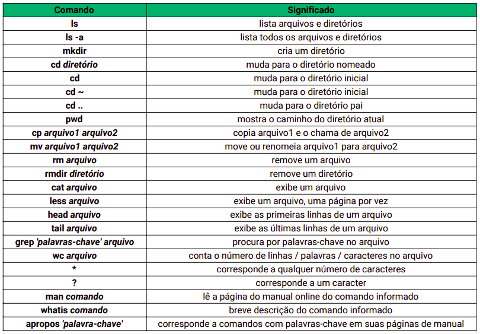

# Unix, Kernel e Shell

## Unix
Desenvolvido por Ken Thompson e Dennis Ritchet utilizando C.
Primeiro a introduzir conceitos e suporte como
- Multiusuarios (sem interferencia)
- Multitarefas
- Portabilidade
Vários sistemas são baseados em Unix consagradas como Mac Os e Linux

Montado em três níveis
- Kernel
- Shell
- Aplicativos

## Kernel
Núcleo do sistema, como fosse o cerebro do sistema, responsável por fazer interação entre hardware e software, iniciado a partir do momento que maquina está ligada.

A partir do login, o kernel administra funções como gerenciamento de memória, processos e arquivos.

## Shell
Shell interface entre sistema operacional, usuário e o kernel (núcleo do sistema), usam interface de linha de comando ou gráfica de usuário.
O clássico terminal, rsrs.
Principais:
- SH
- BASH
- CSH
- TCSH
- ZSH

## Processos e Arquivos
Cada tarefa ou comando é interpretado pelo sistema como processo, tendo um id com pid
- Usuário proprietário
- Sessão do shell
- Estado atual, funcionando, suspenso ou aguardando
- Linha de comando utilizada
- E outras informações

Qualquer coisa no sistema é considerada como arquivo seja um diretório ou dispositivo.

## Comandos Linux

* * *

